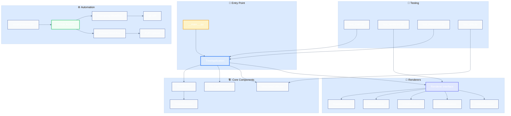
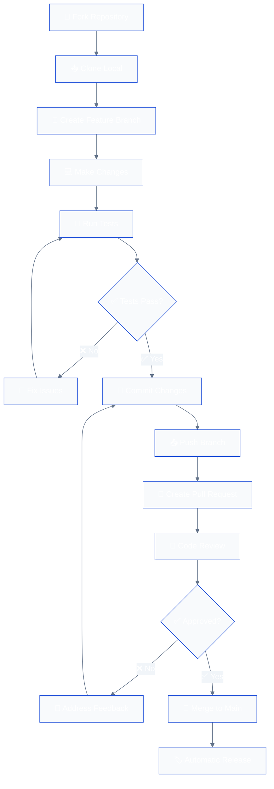
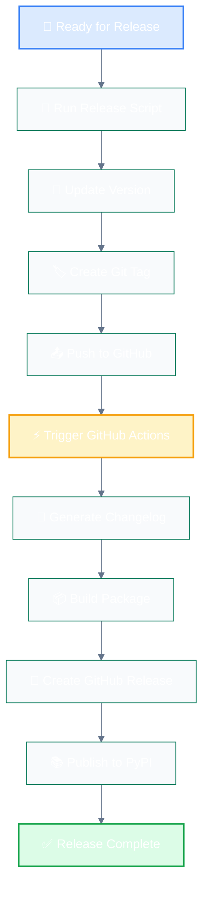
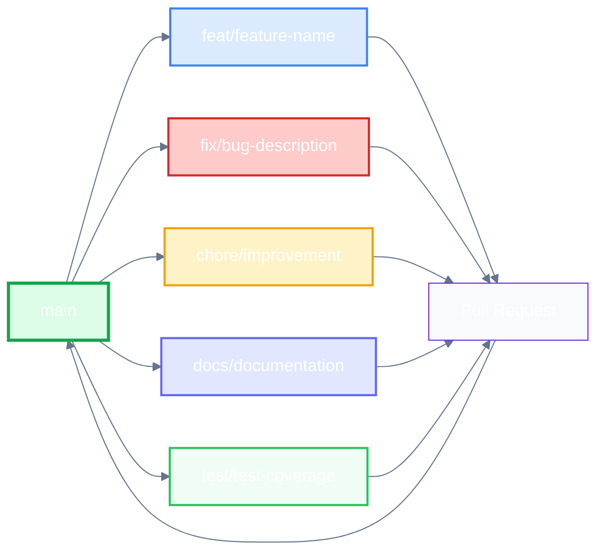
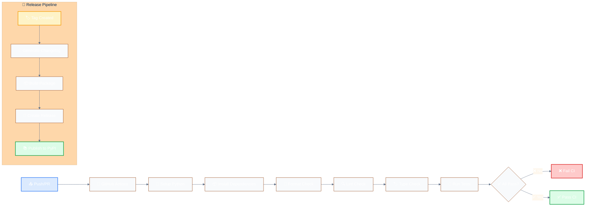
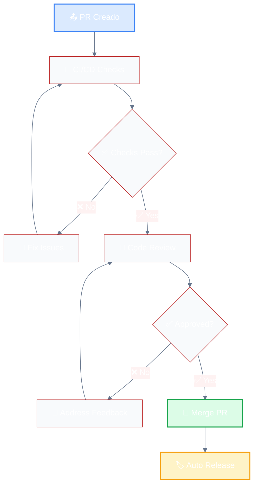

# Contributing to trxd

Thank you for your interest in contributing to **trxd**! This document will guide you through the contribution process and help you understand our workflow.

## 📋 Table of Contents

- [Code of Conduct](#code-of-conduct)
- [How to Contribute](#how-to-contribute)
- [Environment Setup](#environment-setup)
- [Workflow](#workflow)
- [Code Standards](#code-standards)
- [Release Process](#release-process)
- [Reporting Issues](#reporting-issues)
- [Pull Requests](#pull-requests)
- [Additional Resources](#additional-resources)

## 🤝 Code of Conduct

This project follows a code of conduct to ensure a welcoming environment for everyone. By participating, you are expected to maintain respectful and constructive behavior.

## 🚀 How to Contribute

There are many ways to contribute to trxd:

- 🐛 **Report bugs** and issues
- 💡 **Suggest new features**
- 📝 **Improve documentation**
- 🔧 **Contribute code**
- 🧪 **Write or improve tests**
- 📊 **Optimize performance**

## ⚙️ Environment Setup

### Prerequisites

- **Python 3.8+**
- **Git**
- **uv** (dependency manager)

### Installation

```bash
# 1. Fork and clone the repository
git clone https://github.com/your-username/trxd.git
cd trxd

# 2. Install uv if you don't have it
pip install uv

# 3. Install dependencies
uv sync --all-extras

# 4. Verify installation
uv run python -m trxd --help
```

### Project Structure

```
trxd/
├── src/trxd/           # Main source code
├── tests/              # Unit and integration tests
├── scripts/            # Utility scripts
├── .github/workflows/  # GitHub Actions
├── docs/               # Documentation
└── pyproject.toml      # Project configuration
```

### Project Architecture



## 🔄 Workflow

### General Development Flow



### Automated Release Flow



### Branch Conventions



## 📏 Code Standards

### Commit Conventions

We follow **Conventional Commits** to maintain a clear history:

```bash
# Estructura: <type>(<scope>): <description>

# Ejemplos:
feat(auth): add email and password login
fix(api): resolve 500 error when fetching users
docs: update README with installation instructions
chore: bump version to 25.10.4
refactor(utils): improve error handling
test: add unit tests for authentication
```

### Commit Types

| Type | Description | Emoji |
|------|-------------|-------|
| `feat` | Nueva funcionalidad | 🚀 |
| `fix` | Corrección de bugs | 🐛 |
| `docs` | Documentación | 📚 |
| `style` | Formato, espacios, etc. | 🎨 |
| `refactor` | Refactorización de código | 🚜 |
| `test` | Tests | 🧪 |
| `chore` | Tareas de mantenimiento | 🔧 |
| `perf` | Mejoras de rendimiento | ⚡ |
| `ci` | Cambios en CI/CD | ⚙️ |
| `build` | Cambios en build system | 🔨 |

### Quality Tools

Before committing, run:

```bash
# Format code
uv run ruff format .

# Check linting
uv run ruff check --fix .

# Check types
uv run mypy .

# Run tests
uv run pytest
```

### Test Structure

```python
# tests/test_feature.py
import pytest
from trxd import feature_function

class TestFeature:
    def test_basic_functionality(self):
        """Test basic functionality works correctly."""
        result = feature_function("input")
        assert result == "expected_output"
    
    def test_edge_cases(self):
        """Test edge cases and error conditions."""
        with pytest.raises(ValueError):
            feature_function("")
```

## ⚙️ CI/CD Flow

### Continuous Integration Pipeline



### Available Workflows

| Workflow | Trigger | Purpose |
|----------|---------|-----------|
| **CI** | Push/PR | Verify code quality |
| **Changelog** | Tag | Generate changelog automatically |
| **Release** | Tag | Create release and publish to PyPI |

## 🏷️ Release Process

### Automated Release

Our release process is completely automated:

```bash
# Create new release (automatic increment)
python scripts/release.py

# Create release with specific version
python scripts/release.py 25.10.13

# See what would happen without executing
python scripts/release.py --dry-run
```

### What happens automatically?

1. **Version update** in `pyproject.toml`
2. **Tag creation** and push to GitHub
3. **Automatic changelog generation** with `git-cliff`
4. **GitHub release creation** with changelog
5. **Automatic PyPI publication**

### Versioning

We use **Calendar Versioning (CalVer)**:

- **Format**: `YY.MM.MICRO`
- **Example**: `25.10.5` (October 2025, release #5)
- **Advantages**: Easy to understand version age

## 🐛 Reporting Issues

### Before Reporting

1. **Search existing issues** to avoid duplicates
2. **Check the latest version**
3. **Review the documentation**

### Bug Report Template

```markdown
## 🐛 Descripción del Bug
Descripción clara y concisa del problema.

## 🔄 Pasos para Reproducir
1. Ve a '...'
2. Haz clic en '...'
3. Desplázate hasta '...'
4. Ve el error

## ✅ Comportamiento Esperado
Descripción de lo que esperabas que pasara.

## 📸 Capturas de Pantalla
Si aplica, añade capturas de pantalla.

## 🖥️ Información del Sistema
- OS: [e.g. Windows 10, macOS 12.0, Ubuntu 20.04]
- Python: [e.g. 3.9.7]
- trxd: [e.g. 25.10.5]

## 📝 Información Adicional
Cualquier otra información relevante.
```

## 🔄 Pull Requests

### Before Creating a PR

1. **Sync your branch** with `main`
2. **Run all tests** and verify they pass
3. **Update documentation** if necessary
4. **Follow commit conventions**

### Pull Request Template

```markdown
## 📝 Descripción
Descripción clara de los cambios realizados.

## 🔗 Issues Relacionados
Closes #123
Fixes #456

## 🧪 Testing
- [ ] Tests unitarios añadidos/actualizados
- [ ] Tests de integración pasan
- [ ] Verificado manualmente

## 📚 Documentación
- [ ] README actualizado si es necesario
- [ ] Docstrings añadidos/actualizados
- [ ] Comentarios en código si es necesario

## ✅ Checklist
- [ ] Código sigue las convenciones del proyecto
- [ ] Self-review del código realizado
- [ ] Tests pasan localmente
- [ ] Documentación actualizada
```

### Review Process



## 📚 Additional Resources

### Documentation

- [README.md](README.md) - Información general del proyecto
- [CHANGELOG.md](CHANGELOG.md) - Historial de cambios
- [pyproject.toml](pyproject.toml) - Configuración del proyecto

### Tools

- [uv](https://github.com/astral-sh/uv) - Gestor de dependencias
- [ruff](https://github.com/astral-sh/ruff) - Linter y formateador
- [mypy](https://mypy.readthedocs.io/) - Verificador de tipos
- [pytest](https://pytest.org/) - Framework de testing
- [git-cliff](https://git-cliff.org/) - Generador de changelogs

### Useful Links

- [Conventional Commits](https://www.conventionalcommits.org/)
- [Keep a Changelog](https://keepachangelog.com/)
- [Semantic Versioning](https://semver.org/)
- [Calendar Versioning](https://calver.org/)

## 💬 Communication

- **Issues**: For bugs and feature requests
- **Discussions**: For general questions and ideas
- **Pull Requests**: For code contributions

## 💡 Contribution Examples

### Example 1: Adding a New Renderer

```python
# 1. Create the new renderer
class XMLRenderer(Renderer):
    def render(self, tree_generator: TreeGenerator) -> None:
        print('<?xml version="1.0" encoding="UTF-8"?>')
        print('<tree>')
        for item in tree_generator:
            print(f'  <item type="{item.type}" name="{item.name}"/>')
        print('</tree>')

# 2. Add tests
def test_xml_renderer():
    renderer = XMLRenderer()
    # ... tests aquí

# 3. Update TreeApplication to include the new format
```

### Example 2: Improving Filtering

```python
# 1. Add new filtering functionality
class TreeBuilder:
    def __init__(self, args: argparse.Namespace):
        self.args = args
        self.size_filter = self._parse_size_filter(args.size_filter)
    
    def _parse_size_filter(self, size_str: str) -> Optional[tuple]:
        # Implementar filtrado por tamaño
        pass

# 2. Add CLI argument
parser.add_argument('--size-filter', help='Filter by file size (e.g., >1MB)')

# 3. Add tests
def test_size_filtering():
    # ... tests aquí
```

### Example 3: Performance Optimization

```python
# 1. Identify bottleneck
# 2. Implement optimization
class OptimizedTreeBuilder:
    def build_tree(self, directory: Path) -> TreeGenerator:
        # Usar generadores para memoria eficiente
        # Implementar caché para metadatos
        pass

# 3. Add benchmarks
def benchmark_tree_building():
    # Medir rendimiento antes/después
    pass
```

## 🎯 Contribution Roadmap

### 🟢 Easy (Good First Issues)

- [ ] Add more output formats (XML, HTML)
- [ ] Improve error messages
- [ ] Add more integration tests
- [ ] Document advanced use cases

### 🟡 Intermediate

- [ ] Implement advanced filters (date, permissions)
- [ ] Add support for compressed files
- [ ] Optimize performance for large directories
- [ ] Add interactive mode

### 🔴 Advanced

- [ ] Implement parallelization
- [ ] Add database support
- [ ] Create plugin system
- [ ] Implement streaming for large files

## 🏆 Recognition

### Recognized Contribution Types

- 🐛 **Bug Reports**: Help improve stability
- 💡 **Feature Requests**: Guide future development
- 📝 **Documentation**: Make the project more accessible
- 🔧 **Code Contributions**: Improve functionality
- 🧪 **Testing**: Ensure quality
- 🎨 **UI/UX**: Improve user experience

### Outstanding Contributors

Outstanding contributors will appear in:

- README.md as contributors
- CHANGELOG.md in important releases
- GitHub contributors page

## 🙏 Acknowledgments

Thank you for contributing to trxd! Every contribution, no matter how small, makes the project better for everyone.

### How We Acknowledge Contributions

- ✅ **Public recognition** in releases
- ✅ **Mentions** in documentation
- ✅ **Access** to private discussions
- ✅ **Invitation** to collaborate on decisions

---

**Have questions?** Feel free to open an issue or discussion. We're here to help! 🚀

**Ready to contribute?** Start with an issue or fork the repository! 🎉
