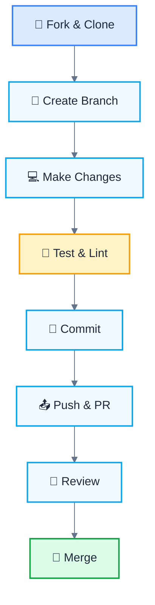
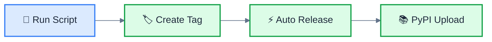
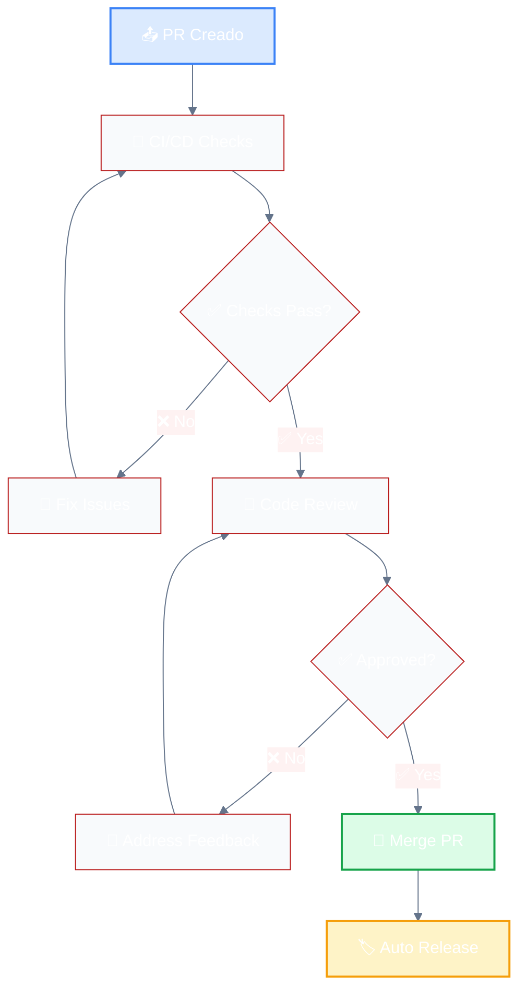

# Contributing to trxd

Thank you for your interest in contributing to **trxd**! This document will guide you through the contribution process and help you understand our workflow.

## 📋 Table of Contents

- [🤝 Code of Conduct](#-code-of-conduct)
- [🚀 How to Contribute](#-how-to-contribute)
- [⚙️ Environment Setup](#️-environment-setup)
- [🔄 Workflow](#-workflow)
- [📏 Code Standards](#-code-standards)
- [⚙️ CI/CD](#️-cicd)
- [🏷️ Release Process](#️-release-process)
- [🐛 Reporting Issues](#-reporting-issues)
- [🔄 Pull Requests](#-pull-requests)
- [📚 Additional Resources](#-additional-resources)
- [💬 Communication](#-communication)
- [💡 Contribution Ideas](#-contribution-ideas)
- [🏆 Recognition](#-recognition)
- [🙏 Acknowledgments](#-acknowledgments)

## 🤝 Code of Conduct

This project follows a code of conduct to ensure a welcoming environment for everyone. By participating, you are expected to maintain respectful and constructive behavior.

## 🚀 How to Contribute

There are many ways to contribute to trxd:

- 🐛 **Report bugs** and issues
- 💡 **Suggest new features**
- 📝 **Improve documentation**
- 🔧 **Contribute code**
- 🧪 **Write or improve tests**
- 📊 **Optimize performance**

## ⚙️ Environment Setup

### Prerequisites

- **Python 3.8+**
- **Git**
- **uv** (dependency manager)

### Installation

```bash
# 1. Fork and clone the repository
git clone https://github.com/your-username/trxd.git
cd trxd

# 2. Install uv if you don't have it
pip install uv

# 3. Install dependencies
uv sync --all-extras

# 4. Verify installation
uv run python -m trxd --help
```bash

### Project Structure

```text
trxd/
├── src/trxd/           # Main source code
├── tests/              # Unit and integration tests
├── scripts/            # Utility scripts
├── .github/workflows/  # GitHub Actions
├── docs/               # Documentation
└── pyproject.toml      # Project configuration
```

## 🔄 Workflow

### Development Process



### Release Process



### Branch Naming

Use descriptive branch names with prefixes:

- `feat/` - New features
- `fix/` - Bug fixes  
- `docs/` - Documentation
- `chore/` - Maintenance tasks
- `test/` - Testing improvements

**Examples:**

- `feat/add-xml-output`
- `fix/csv-encoding-issue`
- `docs/update-readme`

## 📏 Code Standards

### Commit Conventions

We follow **Conventional Commits** to maintain a clear history:

```bash
# Structure: <type>(<scope>): <description>

# Examples:
feat(auth): add email and password login
fix(api): resolve 500 error when fetching users
docs: update README with installation instructions
chore: bump version to 25.10.4
refactor(utils): improve error handling
test: add unit tests for authentication
```

### Commit Types

| Type | Description | Emoji |
|------|-------------|-------|
| `feat` | New functionality | 🚀 |
| `fix` | Bug fixes | 🐛 |
| `docs` | Documentation | 📚 |
| `style` | Formatting, spaces, etc. | 🎨 |
| `refactor` | Code refactoring | 🚜 |
| `test` | Tests | 🧪 |
| `chore` | Maintenance tasks | 🔧 |
| `perf` | Performance improvements | ⚡ |
| `ci` | CI/CD changes | ⚙️ |
| `build` | Build system changes | 🔨 |

### Quality Tools

Before committing, run:

```bash
# Format code
uv run ruff format .

# Check linting
uv run ruff check --fix .

# Check types
uv run mypy .

# Run tests
uv run pytest
```

### Test Structure

```python
# tests/test_feature.py
import pytest
from trxd import feature_function

class TestFeature:
    def test_basic_functionality(self):
        """Test basic functionality works correctly."""
        result = feature_function("input")
        assert result == "expected_output"
    
    def test_edge_cases(self):
        """Test edge cases and error conditions."""
        with pytest.raises(ValueError):
            feature_function("")
```

## ⚙️ CI/CD

Our automated workflows ensure code quality and smooth releases:

### Quality Checks

Every push and PR automatically runs:

- **Code formatting** with `ruff`
- **Linting** with `ruff check`
- **Type checking** with `mypy`
- **Tests** with `pytest`

### Release Automation

When you create a tag, GitHub Actions automatically:

- Generates changelog with `git-cliff`
- Creates GitHub release
- Publishes to PyPI

## 🏷️ Release Process

### Automated Release

Our release process is completely automated:

```bash
# Create new release (automatic increment)
python scripts/release.py

# Create release with specific version
python scripts/release.py 25.10.13

# See what would happen without executing
python scripts/release.py --dry-run
```

### What happens automatically?

1. **Version update** in `pyproject.toml`
2. **Tag creation** and push to GitHub
3. **Automatic changelog generation** with `git-cliff`
4. **GitHub release creation** with changelog
5. **Automatic PyPI publication**

### Versioning

We use **Calendar Versioning (CalVer)**:

- **Format**: `YY.MM.MICRO`
- **Example**: `25.10.5` (October 2025, release #5)
- **Advantages**: Easy to understand version age

## 🐛 Reporting Issues

### Before Reporting

1. **Search existing issues** to avoid duplicates
2. **Check the latest version**
3. **Review the documentation**

### Bug Report Template

```markdown
## 🐛 Bug Description
A clear and concise description of the problem.

## 🔄 Steps to Reproduce
1. Go to '...'
2. Click on '...'
3. Scroll down to '...'
4. See error

## ✅ Expected Behavior
A clear and concise description of what you expected to happen.

## 📸 Screenshots
If applicable, add screenshots to help explain your problem.

## 🖥️ System Information
- OS: [e.g. Windows 10, macOS 12.0, Ubuntu 20.04]
- Python: [e.g. 3.9.7]
- trxd: [e.g. 25.10.5]

## 📝 Additional Information
Any other relevant information about the problem.
```

## 🔄 Pull Requests

### Before Creating a PR

1. **Sync your branch** with `main`
2. **Run all tests** and verify they pass
3. **Update documentation** if necessary
4. **Follow commit conventions**

### Pull Request Template

```markdown
## 📝 Description
Clear description of the changes made in this PR.

## 🔗 Related Issues
Closes #123
Fixes #456

## 🧪 Testing
- [ ] Unit tests added/updated
- [ ] Integration tests pass
- [ ] Manually verified

## 📚 Documentation
- [ ] README updated if necessary
- [ ] Docstrings added/updated
- [ ] Code comments if necessary

## ✅ Checklist
- [ ] Code follows project conventions
- [ ] Self-review of code completed
- [ ] Tests pass locally
- [ ] Documentation updated
```

### Review Process



## 📚 Additional Resources

### Documentation

- [README.md](README.md) - General project information
- [CHANGELOG.md](CHANGELOG.md) - Change history
- [pyproject.toml](pyproject.toml) - Project configuration

### Tools

- [uv](https://github.com/astral-sh/uv) - Dependency manager
- [ruff](https://github.com/astral-sh/ruff) - Linter and formatter
- [mypy](https://mypy.readthedocs.io/) - Type checker
- [pytest](https://pytest.org/) - Testing framework
- [git-cliff](https://git-cliff.org/) - Changelog generator

### Useful Links

- [Conventional Commits](https://www.conventionalcommits.org/)
- [Keep a Changelog](https://keepachangelog.com/)
- [Semantic Versioning](https://semver.org/)
- [Calendar Versioning](https://calver.org/)

## 💬 Communication

- **Issues**: For bugs and feature requests
- **Discussions**: For general questions and ideas
- **Pull Requests**: For code contributions

## 💡 Contribution Ideas

### Good First Issues

- Add new output formats (XML, HTML)
- Improve error messages and help text
- Add more integration tests
- Document advanced use cases

### Intermediate Tasks

- Implement advanced filters (date, permissions)
- Add support for compressed files
- Optimize performance for large directories
- Add interactive mode

### Advanced Features

- Implement parallelization
- Add database support
- Create plugin system
- Implement streaming for large files

## 🏆 Recognition

### Recognized Contribution Types

- 🐛 **Bug Reports**: Help improve stability
- 💡 **Feature Requests**: Guide future development
- 📝 **Documentation**: Make the project more accessible
- 🔧 **Code Contributions**: Improve functionality
- 🧪 **Testing**: Ensure quality
- 🎨 **UI/UX**: Improve user experience

### Outstanding Contributors

Outstanding contributors will appear in:

- README.md as contributors
- CHANGELOG.md in important releases
- GitHub contributors page

## 🙏 Acknowledgments

Thank you for contributing to trxd! Every contribution, no matter how small, makes the project better for everyone.

### How We Acknowledge Contributions

- ✅ **Public recognition** in releases
- ✅ **Mentions** in documentation
- ✅ **Access** to private discussions
- ✅ **Invitation** to collaborate on decisions

---

**Have questions?** Feel free to open an issue or discussion. We're here to help! 🚀

**Ready to contribute?** Start with an issue or fork the repository! 🎉
