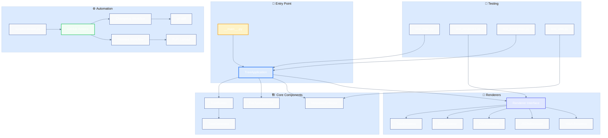
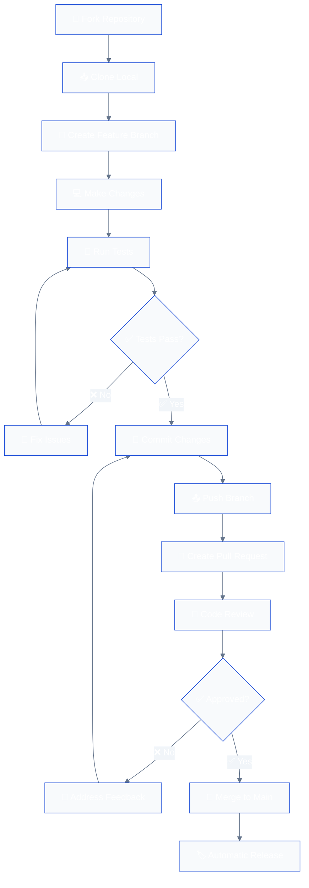
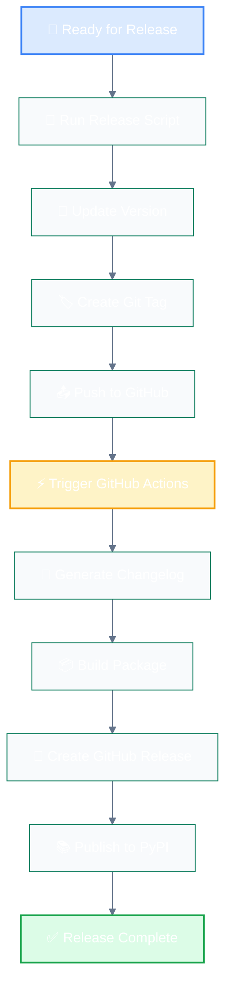
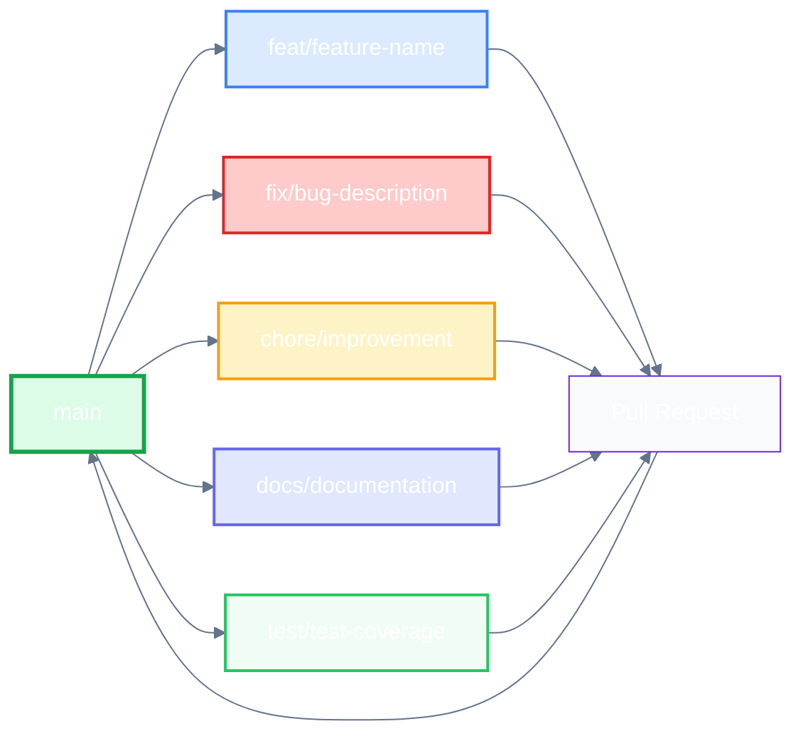
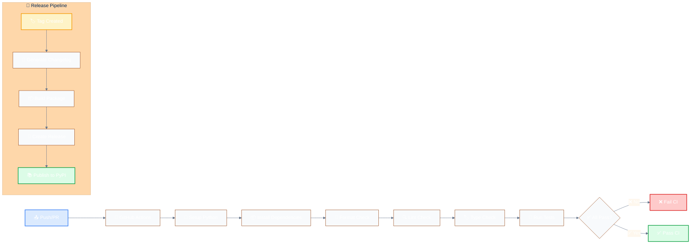
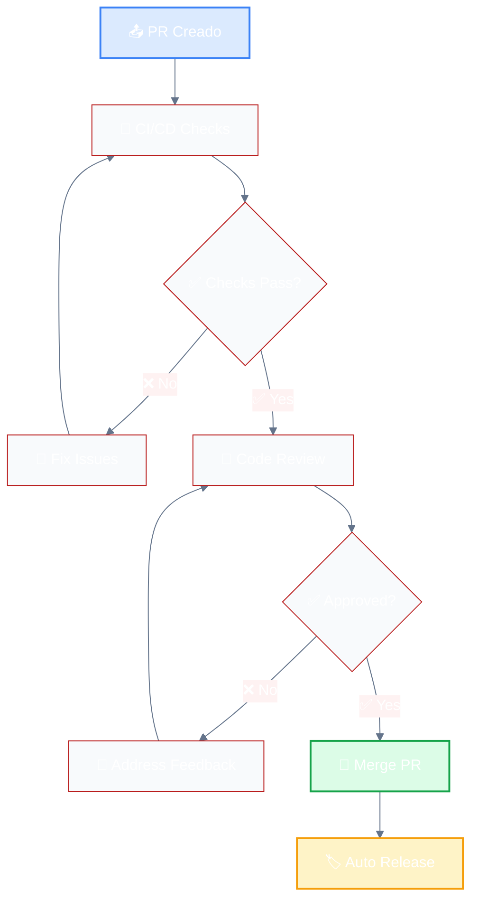

# Contributing to trxd

¡Gracias por tu interés en contribuir a **trxd**! Este documento te guiará a través del proceso de contribución y te ayudará a entender nuestro flujo de trabajo.

## 📋 Tabla de Contenidos

- [Código de Conducta](#código-de-conducta)
- [¿Cómo Contribuir?](#cómo-contribuir)
- [Configuración del Entorno](#configuración-del-entorno)
- [Flujo de Trabajo](#flujo-de-trabajo)
- [Estándares de Código](#estándares-de-código)
- [Proceso de Release](#proceso-de-release)
- [Reportar Issues](#reportar-issues)
- [Pull Requests](#pull-requests)
- [Recursos Adicionales](#recursos-adicionales)

## 🤝 Código de Conducta

Este proyecto sigue un código de conducta para asegurar un ambiente acogedor para todos. Al participar, se espera que mantengas un comportamiento respetuoso y constructivo.

## 🚀 ¿Cómo Contribuir?

Hay muchas formas de contribuir a trxd:

- 🐛 **Reportar bugs** y problemas
- 💡 **Sugerir nuevas funcionalidades**
- 📝 **Mejorar la documentación**
- 🔧 **Contribuir código**
- 🧪 **Escribir o mejorar tests**
- 📊 **Optimizar rendimiento**

## ⚙️ Configuración del Entorno

### Prerrequisitos

- **Python 3.8+**
- **Git**
- **uv** (gestor de dependencias)

### Instalación

```bash
# 1. Fork y clona el repositorio
git clone https://github.com/tu-usuario/trxd.git
cd trxd

# 2. Instala uv si no lo tienes
pip install uv

# 3. Instala dependencias
uv sync --all-extras

# 4. Verifica la instalación
uv run python -m trxd --help
```

### Estructura del Proyecto

```
trxd/
├── src/trxd/           # Código fuente principal
├── tests/              # Tests unitarios e integración
├── scripts/            # Scripts de utilidad
├── .github/workflows/  # GitHub Actions
├── docs/               # Documentación
└── pyproject.toml      # Configuración del proyecto
```

### Arquitectura del Proyecto



## 🔄 Flujo de Trabajo

### Flujo de Desarrollo General



### Flujo de Release Automatizado



### Convenciones de Branches



## 📏 Estándares de Código

### Convenciones de Commits

Seguimos **Conventional Commits** para mantener un historial claro:

```bash
# Estructura: <type>(<scope>): <description>

# Ejemplos:
feat(auth): add email and password login
fix(api): resolve 500 error when fetching users
docs: update README with installation instructions
chore: bump version to 25.10.4
refactor(utils): improve error handling
test: add unit tests for authentication
```

### Tipos de Commits

| Tipo | Descripción | Emoji |
|------|-------------|-------|
| `feat` | Nueva funcionalidad | 🚀 |
| `fix` | Corrección de bugs | 🐛 |
| `docs` | Documentación | 📚 |
| `style` | Formato, espacios, etc. | 🎨 |
| `refactor` | Refactorización de código | 🚜 |
| `test` | Tests | 🧪 |
| `chore` | Tareas de mantenimiento | 🔧 |
| `perf` | Mejoras de rendimiento | ⚡ |
| `ci` | Cambios en CI/CD | ⚙️ |
| `build` | Cambios en build system | 🔨 |

### Herramientas de Calidad

Antes de hacer commit, ejecuta:

```bash
# Formatear código
uv run ruff format .

# Verificar linting
uv run ruff check --fix .

# Verificar tipos
uv run mypy .

# Ejecutar tests
uv run pytest
```

### Estructura de Tests

```python
# tests/test_feature.py
import pytest
from trxd import feature_function

class TestFeature:
    def test_basic_functionality(self):
        """Test basic functionality works correctly."""
        result = feature_function("input")
        assert result == "expected_output"
    
    def test_edge_cases(self):
        """Test edge cases and error conditions."""
        with pytest.raises(ValueError):
            feature_function("")
```

## ⚙️ Flujo de CI/CD

### Pipeline de Integración Continua



### Workflows Disponibles

| Workflow | Trigger | Propósito |
|----------|---------|-----------|
| **CI** | Push/PR | Verificar calidad del código |
| **Changelog** | Tag | Generar changelog automáticamente |
| **Release** | Tag | Crear release y publicar a PyPI |

## 🏷️ Proceso de Release

### Release Automatizado

Nuestro proceso de release está completamente automatizado:

```bash
# Crear nueva release (incremento automático)
python scripts/release.py

# Crear release con versión específica
python scripts/release.py 25.10.13

# Ver qué pasaría sin ejecutar
python scripts/release.py --dry-run
```

### ¿Qué pasa automáticamente?

1. **Actualización de versión** en `pyproject.toml`
2. **Creación de tag** y push a GitHub
3. **Generación de changelog** automática con `git-cliff`
4. **Creación de GitHub release** con changelog
5. **Publicación a PyPI** automática

### Versionado

Usamos **Calendar Versioning (CalVer)**:

- **Formato**: `YY.MM.MICRO`
- **Ejemplo**: `25.10.5` (Octubre 2025, release #5)
- **Ventajas**: Fácil de entender la antigüedad de versiones

## 🐛 Reportar Issues

### Antes de Reportar

1. **Busca issues existentes** para evitar duplicados
2. **Verifica la versión** más reciente
3. **Revisa la documentación**

### Template de Bug Report

```markdown
## 🐛 Descripción del Bug
Descripción clara y concisa del problema.

## 🔄 Pasos para Reproducir
1. Ve a '...'
2. Haz clic en '...'
3. Desplázate hasta '...'
4. Ve el error

## ✅ Comportamiento Esperado
Descripción de lo que esperabas que pasara.

## 📸 Capturas de Pantalla
Si aplica, añade capturas de pantalla.

## 🖥️ Información del Sistema
- OS: [e.g. Windows 10, macOS 12.0, Ubuntu 20.04]
- Python: [e.g. 3.9.7]
- trxd: [e.g. 25.10.5]

## 📝 Información Adicional
Cualquier otra información relevante.
```

## 🔄 Pull Requests

### Antes de Crear un PR

1. **Sincroniza tu branch** con `main`
2. **Ejecuta todos los tests** y verifica que pasen
3. **Actualiza la documentación** si es necesario
4. **Sigue las convenciones** de commits

### Template de Pull Request

```markdown
## 📝 Descripción
Descripción clara de los cambios realizados.

## 🔗 Issues Relacionados
Closes #123
Fixes #456

## 🧪 Testing
- [ ] Tests unitarios añadidos/actualizados
- [ ] Tests de integración pasan
- [ ] Verificado manualmente

## 📚 Documentación
- [ ] README actualizado si es necesario
- [ ] Docstrings añadidos/actualizados
- [ ] Comentarios en código si es necesario

## ✅ Checklist
- [ ] Código sigue las convenciones del proyecto
- [ ] Self-review del código realizado
- [ ] Tests pasan localmente
- [ ] Documentación actualizada
```

### Proceso de Review



## 📚 Recursos Adicionales

### Documentación

- [README.md](README.md) - Información general del proyecto
- [CHANGELOG.md](CHANGELOG.md) - Historial de cambios
- [pyproject.toml](pyproject.toml) - Configuración del proyecto

### Herramientas

- [uv](https://github.com/astral-sh/uv) - Gestor de dependencias
- [ruff](https://github.com/astral-sh/ruff) - Linter y formateador
- [mypy](https://mypy.readthedocs.io/) - Verificador de tipos
- [pytest](https://pytest.org/) - Framework de testing
- [git-cliff](https://git-cliff.org/) - Generador de changelogs

### Enlaces Útiles

- [Conventional Commits](https://www.conventionalcommits.org/)
- [Keep a Changelog](https://keepachangelog.com/)
- [Semantic Versioning](https://semver.org/)
- [Calendar Versioning](https://calver.org/)

## 💬 Comunicación

- **Issues**: Para bugs y feature requests
- **Discussions**: Para preguntas generales y ideas
- **Pull Requests**: Para contribuciones de código

## 💡 Ejemplos de Contribución

### Ejemplo 1: Añadir un Nuevo Renderer

```python
# 1. Crear el nuevo renderer
class XMLRenderer(Renderer):
    def render(self, tree_generator: TreeGenerator) -> None:
        print('<?xml version="1.0" encoding="UTF-8"?>')
        print('<tree>')
        for item in tree_generator:
            print(f'  <item type="{item.type}" name="{item.name}"/>')
        print('</tree>')

# 2. Añadir tests
def test_xml_renderer():
    renderer = XMLRenderer()
    # ... tests aquí

# 3. Actualizar TreeApplication para incluir el nuevo formato
```

### Ejemplo 2: Mejorar el Filtrado

```python
# 1. Añadir nueva funcionalidad de filtrado
class TreeBuilder:
    def __init__(self, args: argparse.Namespace):
        self.args = args
        self.size_filter = self._parse_size_filter(args.size_filter)
    
    def _parse_size_filter(self, size_str: str) -> Optional[tuple]:
        # Implementar filtrado por tamaño
        pass

# 2. Añadir argumento CLI
parser.add_argument('--size-filter', help='Filter by file size (e.g., >1MB)')

# 3. Añadir tests
def test_size_filtering():
    # ... tests aquí
```

### Ejemplo 3: Optimización de Rendimiento

```python
# 1. Identificar cuello de botella
# 2. Implementar optimización
class OptimizedTreeBuilder:
    def build_tree(self, directory: Path) -> TreeGenerator:
        # Usar generadores para memoria eficiente
        # Implementar caché para metadatos
        pass

# 3. Añadir benchmarks
def benchmark_tree_building():
    # Medir rendimiento antes/después
    pass
```

## 🎯 Roadmap de Contribuciones

### 🟢 Fácil (Good First Issues)

- [ ] Añadir más formatos de salida (XML, HTML)
- [ ] Mejorar mensajes de error
- [ ] Añadir más tests de integración
- [ ] Documentar casos de uso avanzados

### 🟡 Intermedio

- [ ] Implementar filtros avanzados (fecha, permisos)
- [ ] Añadir soporte para archivos comprimidos
- [ ] Optimizar rendimiento para directorios grandes
- [ ] Añadir modo interactivo

### 🔴 Avanzado

- [ ] Implementar paralelización
- [ ] Añadir soporte para bases de datos
- [ ] Crear plugin system
- [ ] Implementar streaming para archivos grandes

## 🏆 Reconocimientos

### Tipos de Contribución Reconocidas

- 🐛 **Bug Reports**: Ayudan a mejorar la estabilidad
- 💡 **Feature Requests**: Guían el desarrollo futuro
- 📝 **Documentación**: Hacen el proyecto más accesible
- 🔧 **Code Contributions**: Mejoran la funcionalidad
- 🧪 **Testing**: Aseguran la calidad
- 🎨 **UI/UX**: Mejoran la experiencia de usuario

### Contribuidores Destacados

Los contribuidores destacados aparecerán en:
- README.md como contribuidores
- CHANGELOG.md en releases importantes
- GitHub contributors page

## 🙏 Agradecimientos

¡Gracias por contribuir a trxd! Cada contribución, por pequeña que sea, hace que el proyecto sea mejor para todos.

### Cómo Agradecemos las Contribuciones

- ✅ **Reconocimiento público** en releases
- ✅ **Menciones** en documentación
- ✅ **Acceso** a discussions privadas
- ✅ **Invitación** a colaborar en decisiones

---

**¿Tienes preguntas?** No dudes en abrir un issue o discussion. ¡Estamos aquí para ayudar! 🚀

**¿Listo para contribuir?** ¡Empieza con un issue o fork el repositorio! 🎉
